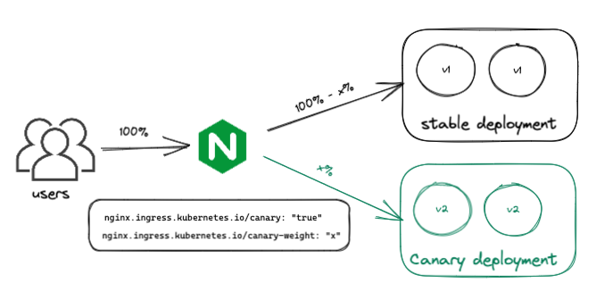
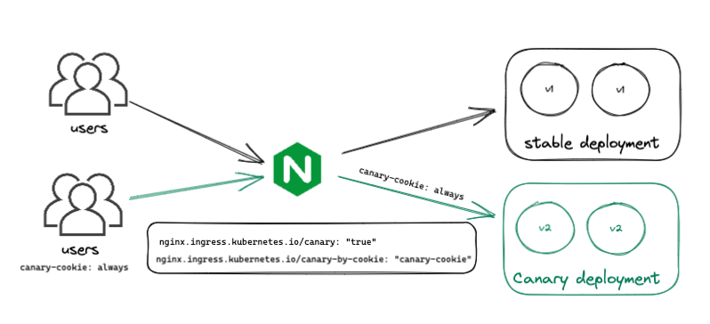

# Canary deployments with NGiNX ingress controller

Canary release runs two versions of applications simultaneously, the old version is called stable and  the new version is called canary. Updates are rolled out to a small amount of users (f.ex. 10%), so they can test it and provide a feedback and when the change is accepted we roll out the update to the rest of users.

## Prerequisites

Install kind <https://kind.sigs.k8s.io/docs/user/quick-start/#installation>
Create a cluster
```bash
kind create cluster
```

Switch context
```
kubectl cluster-info --context kind-kind
```

Install helm 3

```bash
curl https://raw.githubusercontent.com/helm/helm/main/scripts/get-helm-3 | bash
```

Install NGiNX ingress controller via helm chart

```bash
$ helm upgrade --install ingress-nginx ingress-nginx \
  --repo https://kubernetes.github.io/ingress-nginx \
  --namespace ingress-nginx --create-namespace
```

## Basics

In order to serve two versions of applications v1 (stable) and v2 (canary) we need to create:

- 2x deployments with 2x services: `deployment-v1.yaml`, `deployment-v2.yaml`, `service-v1.yaml`, `service-v2.yaml`.
- 2x ingresses - one for traffic to stable v1 deployment `ingress-stable.yaml` and second for the canary v2 deployment `ingress-canary.yaml`.

The `deployment-v1.yaml` and the `deployment-v2.yaml` are basically the same, apart from the name, labels and the image tag (or just some arguments in our case).
The `service-v1.yaml` and the `service-v2.yaml` are also the same, except for the name and the label selector.
The `ingress-stable.yaml` forwards traffic to service v1, we don't set any canary options here. In `ingress-canary.yaml` we set configuration via annotations for a canary release.

Be aware that currently you can apply only one canary ingress per ingress rule, so you can serve only 2 versions of applications at the same time with NGiNX ingress controller.

## Traffic-splitting strategies

NGINX Ingress Controller supports traffic-splitting policies based on header, cookie, and weight. Whereas header- and cookie-based policies serve to provide a new service version to a subset of users, weight-based policies serve to divert a percentage of traffic to a new service version.

### NGINX ingress annotations

NGINX Ingress Controller uses the following annotations to enable canary deployments:

- `nginx.ingress.kubernetes.io/canary-by-header`
- `nginx.ingress.kubernetes.io/canary-by-header-value`
- `nginx.ingress.kubernetes.io/canary-by-header-pattern`
- `nginx.ingress.kubernetes.io/canary-by-cookie`
- `nginx.ingress.kubernetes.io/canary-weight`

Canary rules are evaluated in the following order:

- canary-by-header
- canary-by-cookie
- canary-weight

### By weight



```yml
  # 01-canary-weight/ingress-canary.yaml
  annotations:
    nginx.ingress.kubernetes.io/canary: "true"
    nginx.ingress.kubernetes.io/canary-weight: "30"
```

#### Example

Deploy deployments and services objects first

```bash
$ kubectl apply -f .
deployment.apps/demo-v1 created
deployment.apps/demo-v2 created
service/demo-v1 created
service/demo-v2 created

```

Deploy ingress objects from `01-canary-weight` dir

```bash
$ cd 01-canary-weight/
$ kubectl apply -f .
ingress.networking.k8s.io/canary created
ingress.networking.k8s.io/stable created
```

Run `curl`

```bash
curl -H "Host: echo.local" ${IP_ADDRESS}`
```

First check our ingress address & host

```bash
$ kubectl get ingress
NAME   CLASS   HOSTS        ADDRESS   PORTS   AGE
canary   <none>   demo.local             80      2m38s
stable   <none>   demo.local             80      2m38s
```

We can use ingress-nginx-controller EXTERNAL-IP address, but we run it on local cluster.

```bash
$ kubectl get services -n ingress-nginx
NAME                                 TYPE           CLUSTER-IP      EXTERNAL-IP   PORT(S)                      AGE
ingress-nginx-controller-admission   ClusterIP      10.43.76.22     <none>        443/TCP                      21h
ingress-nginx-controller             LoadBalancer   10.43.237.222   <pending>     80:31454/TCP,443:32140/TCP   21h
```

We can forward ports

```bash
$ kubectl port-forward svc/ingress-nginx-controller -n ingress-nginx 8080:80
```

Hit to our endpoint a few times by running `curl -H "Host: demo.local" localhost:8080

```bash
$ curl -H "Host: demo.local" localhost:8080
"v2, pod-> demo-v2-885587579-hhzts"

$ curl -H "Host: demo.local" localhost:8080
"v1, pod-> demo-v2-765749d75d-4vnpb"
```

We can call in loop

```bash
$ for i in $(seq 1 10); do curl -H "Host: demo.local" localhost:8080; done
"v1, pod-> demo-v1-77d7fd9d9b-bhqgh"
"v1, pod-> demo-v1-77d7fd9d9b-mv5d6"
"v1, pod-> demo-v1-77d7fd9d9b-bhqgh"
"v2, pod-> demo-v2-885587579-b6fhb"
"v1, pod-> demo-v1-77d7fd9d9b-mv5d6"
"v1, pod-> demo-v1-77d7fd9d9b-bhqgh"
"v1, pod-> demo-v1-77d7fd9d9b-mv5d6"
"v1, pod-> demo-v1-77d7fd9d9b-bhqgh"
"v1, pod-> demo-v1-77d7fd9d9b-mv5d6"
"v1, pod-> demo-v1-77d7fd9d9b-bhqgh"
```

And we can observe that in the most time `v1` application is served.

We can also test with k6

```bash
k6 run k6/script.js


          /\      |‾‾| /‾‾/   /‾‾/
     /\  /  \     |  |/  /   /  /
    /  \/    \    |     (   /   ‾‾\
   /          \   |  |\  \ |  (‾)  |
  / __________ \  |__| \__\ \_____/ .io

  execution: local
     script: script.js
     output: -

  scenarios: (100.00%) 1 scenario, 20 max VUs, 33s max duration (incl. graceful stop):
           * default: Up to 20 looping VUs for 3s over 3 stages (gracefulRampDown: 30s, gracefulStop: 30s)


running (03.5s), 00/20 VUs, 50 complete and 0 interrupted iterations
default ✓ [======================================] 00/20 VUs  3s

     ✓ status code is 200
     ✓ deployment is stable or canary

   ✓ checks.........................: 100.00% ✓ 100       ✗ 0
     data_received..................: 11 kB   3.1 kB/s
     data_sent......................: 5.3 kB  1.5 kB/s
     http_req_blocked...............: avg=191.32µs min=5µs    med=11µs   max=1.39ms  p(90)=471.8µs p(95)=578.39µs
     http_req_connecting............: avg=123.22µs min=0s     med=0s     max=389µs   p(90)=340.2µs p(95)=367.9µs
   ✓ http_req_duration..............: avg=3.95ms   min=1.61ms med=3.55ms max=16.11ms p(90)=6.53ms  p(95)=7.97ms
       { expected_response:true }...: avg=3.95ms   min=1.61ms med=3.55ms max=16.11ms p(90)=6.53ms  p(95)=7.97ms
     http_req_failed................: 0.00%   ✓ 0         ✗ 50
     http_req_rate..................: 50.00%  ✓ 50        ✗ 50
     ✓ { deployment:canary }........: 12.00%  ✓ 6         ✗ 44
     ✓ { deployment:stable }........: 88.00%  ✓ 44        ✗ 6
     http_req_receiving.............: avg=64.6µs   min=31µs   med=55.5µs max=159µs   p(90)=96.2µs  p(95)=129.64µs
     http_req_sending...............: avg=67.9µs   min=17µs   med=39µs   max=406µs   p(90)=103.5µs p(95)=286.14µs
     http_req_tls_handshaking.......: avg=0s       min=0s     med=0s     max=0s      p(90)=0s      p(95)=0s
     http_req_waiting...............: avg=3.82ms   min=1.49ms med=3.41ms max=15.84ms p(90)=6.37ms  p(95)=7.66ms
     http_reqs......................: 50      14.305853/s
     iteration_duration.............: avg=1s       min=1s     med=1s     max=1.01s   p(90)=1s      p(95)=1s
     iterations.....................: 50      14.305853/s
     vus............................: 11      min=11      max=20
     vus_max........................: 20      min=20      max=20
```

### By cookie



```yml
 # 02-canary-cookie/ingress-canary.yaml
 annotations:
    nginx.ingress.kubernetes.io/canary: "true"
    nginx.ingress.kubernetes.io/canary-by-cookie: "canary-cookie"
```

Deploy ingress `02-canary-cookie` objects

```bash
$ cd 02-canary-cookie
$ kubectl apply -f .
ingress.networking.k8s.io/canary configured
ingress.networking.k8s.io/stable configured
```

```bash
❯ for i in $(seq 1 10); do curl -H "Host: demo.local" localhost:8080 --cookie "canary-cookie=always"; done
"v2, pod-> demo-v2-885587579-b6fhb"
"v2, pod-> demo-v2-885587579-hhzts"
"v2, pod-> demo-v2-885587579-b6fhb"
"v2, pod-> demo-v2-885587579-hhzts"
"v2, pod-> demo-v2-885587579-b6fhb"
"v2, pod-> demo-v2-885587579-hhzts"
"v2, pod-> demo-v2-885587579-b6fhb"
"v2, pod-> demo-v2-885587579-hhzts"
"v2, pod-> demo-v2-885587579-b6fhb"
"v2, pod-> demo-v2-885587579-hhzts"
```

Or via k6

```bash
k6 run k6/script.js

          /\      |‾‾| /‾‾/   /‾‾/
     /\  /  \     |  |/  /   /  /
    /  \/    \    |     (   /   ‾‾\
   /          \   |  |\  \ |  (‾)  |
  / __________ \  |__| \__\ \_____/ .io

  execution: local
     script: k6/script.js
     output: -

  scenarios: (100.00%) 1 scenario, 20 max VUs, 33s max duration (incl. graceful stop):
           * default: Up to 20 looping VUs for 3s over 3 stages (gracefulRampDown: 30s, gracefulStop: 30s)


running (03.5s), 00/20 VUs, 50 complete and 0 interrupted iterations
default ✓ [======================================] 00/20 VUs  3s

     ✓ status code is 200
     ✓ deployment is stable or canary

   ✓ checks.........................: 100.00% ✓ 100       ✗ 0
     data_received..................: 11 kB   3.1 kB/s
     data_sent......................: 5.3 kB  1.5 kB/s
     http_req_blocked...............: avg=217.78µs min=4µs    med=8µs    max=3.96ms p(90)=386.1µs  p(95)=468.2µs
     http_req_connecting............: avg=110.22µs min=0s     med=0s     max=422µs  p(90)=297.39µs p(95)=340.39µs
   ✓ http_req_duration..............: avg=3.67ms   min=1.51ms med=3.18ms max=9.87ms p(90)=6.52ms   p(95)=7.77ms
       { expected_response:true }...: avg=3.67ms   min=1.51ms med=3.18ms max=9.87ms p(90)=6.52ms   p(95)=7.77ms
     http_req_failed................: 0.00%   ✓ 0         ✗ 50
     http_req_rate..................: 50.00%  ✓ 50        ✗ 50
     ✓ { deployment:canary }........: 100.00% ✓ 50        ✗ 0
     ✓ { deployment:stable }........: 0.00%   ✓ 0         ✗ 50
     http_req_receiving.............: avg=68.1µs   min=23µs   med=61.5µs max=363µs  p(90)=91.1µs   p(95)=98.39µs
     http_req_sending...............: avg=51.49µs  min=19µs   med=34µs   max=489µs  p(90)=72.8µs   p(95)=101.09µs
     http_req_tls_handshaking.......: avg=0s       min=0s     med=0s     max=0s     p(90)=0s       p(95)=0s
     http_req_waiting...............: avg=3.55ms   min=1.44ms med=3.08ms max=9.34ms p(90)=6.4ms    p(95)=7.67ms
     http_reqs......................: 50      14.320308/s
     iteration_duration.............: avg=1s       min=1s     med=1s     max=1.01s  p(90)=1s       p(95)=1s
     iterations.....................: 50      14.320308/s
     vus............................: 11      min=11      max=20
     vus_max........................: 20      min=20      max=20
```

Because we set `canary-cookie=always`, all requests go to deployment v2.

### By header

```yml
  annotations:
    nginx.ingress.kubernetes.io/canary: "true"
    nginx.ingress.kubernetes.io/canary-weight: "10"
    nginx.ingress.kubernetes.io/canary-by-header: "x-region"
    nginx.ingress.kubernetes.io/canary-by-header-value: "us-east"
```

```bash
$ cd 03-canary-header
$ kubectl apply -f .
ingress.networking.k8s.io/canary configured
ingress.networking.k8s.io/stable unchanged
```

Run

```bash
$ for i in $(seq 1 10); do curl -H "Host: demo.local" -H "x-region: us-east" localhost:8080; done
"v2, pod-> demo-v2-885587579-hhzts"
"v2, pod-> demo-v2-885587579-b6fhb"
"v2, pod-> demo-v2-885587579-hhzts"
"v2, pod-> demo-v2-885587579-b6fhb"
"v2, pod-> demo-v2-885587579-hhzts"
"v2, pod-> demo-v2-885587579-b6fhb"
"v2, pod-> demo-v2-885587579-hhzts"
"v2, pod-> demo-v2-885587579-b6fhb"
"v2, pod-> demo-v2-885587579-hhzts"
"v2, pod-> demo-v2-885587579-b6fhb"
```

## Sticky sessions

Sticky sessions or session affinity, is a feature that allows you to keep a session alive for a certain period of time.
It's useful when you want to serve to the same client the same version of application.

```yml
# 04-canary-sticky/ingress-stable.yaml
  annotations:
    nginx.ingress.kubernetes.io/affinity: "cookie" # enable the sticky session 
    nginx.ingress.kubernetes.io/session-cookie-name: "sticky-cookie" # the name of the cookie (default: INGRESSCOOKIE)
    nginx.ingress.kubernetes.io/session-cookie-max-age: "3600" # the time before the cookie expires (in seconds)
```

Deploy ingress `04-canary-sticky`

```bash
$ cd 04-sticky-cookie
$ kubectl apply -f .
ingress.networking.k8s.io/canary unchanged
ingress.networking.k8s.io/stable configured
```

Get generated cookie

```bash
$ curl -I -H "Host: demo.local" localhost:8080

HTTP/1.1 200 OK
Date: Wed, 04 Jan 2023 15:08:52 GMT
Content-Type: text/plain; charset=utf-8
Content-Length: 36
Connection: keep-alive
Set-Cookie: sticky-cookie=1672844933.857.407.640833|8b45add0f6cb4324640de27dbbf356ef; Max-Age=3600; Path=/; HttpOnly
X-App-Name:
X-App-Version: 0.2.4
```

Run curl attaching the sticky cookie

```bash
$ for i in $(seq 1 100); do curl -H "Host: demo.local" localhost:8080 --cookie "sticky-cookie=1672844933.857.407.640833|8b45add0f6cb4324640de27dbbf356ef"; sleep 1; done
"v1, pod-> demo-v1-77d7fd9d9b-bhqgh"
"v1, pod-> demo-v1-77d7fd9d9b-bhqgh"
"v1, pod-> demo-v1-77d7fd9d9b-bhqgh"
"v1, pod-> demo-v1-77d7fd9d9b-bhqgh"
"v1, pod-> demo-v1-77d7fd9d9b-bhqgh"
"v1, pod-> demo-v1-77d7fd9d9b-bhqgh"
"v1, pod-> demo-v1-77d7fd9d9b-bhqgh"
"v1, pod-> demo-v1-77d7fd9d9b-bhqgh"
"v1, pod-> demo-v1-77d7fd9d9b-bhqgh"
... // after deleting pod
"v1, pod-> demo-v1-77d7fd9d9b-8xww2"
...
```

Sticky sessions always route to the same pod. If it's killed, it routes to different pod from the same deployment. We can test it and delete the pod in the meantime from the other console:

```bash
kubectl delete po demo-v1-77d7fd9d9b-bhqgh
pod "demo-v1-77d7fd9d9b-bhqgh" deleted
```

> Session affinity for canaries works since 0.49.0 version of NGiNX Ingress Controller.
